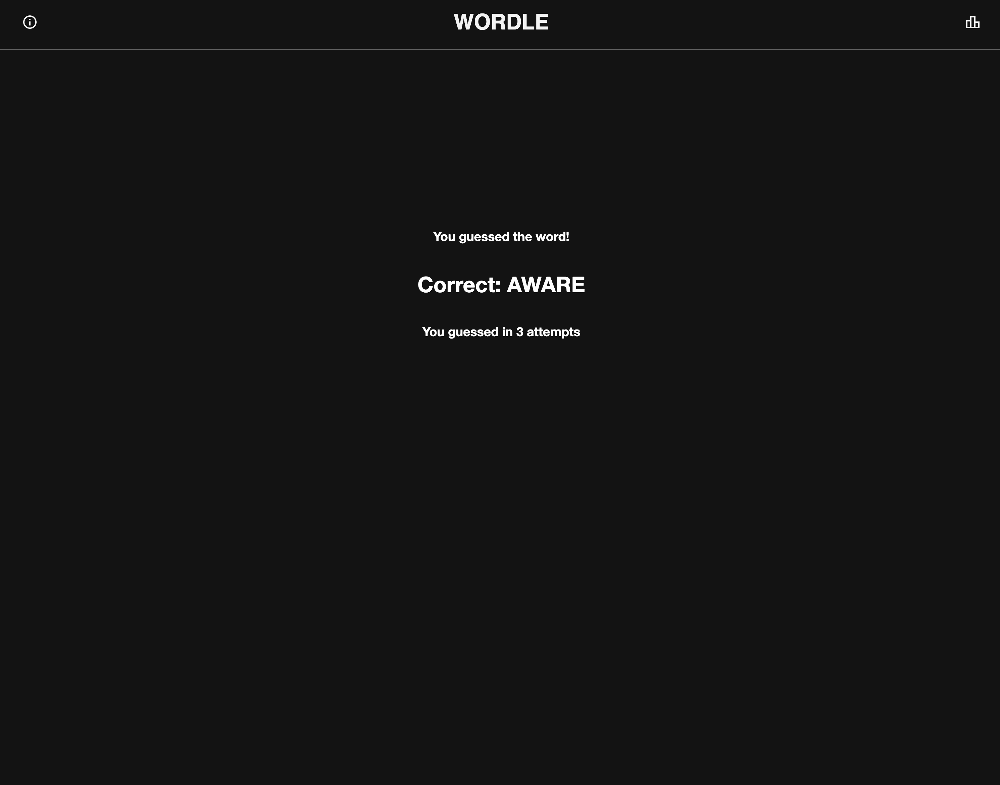

# Wordle Clone

 

Wordle clone built using React. State managed with the Context API.

 

#### Built using:

<ul>
    <li>React</li>
    <li>Context</li>
    <li>CSS</li>
</ul>

 

## Game Screen

Functionality includes coloured highlighting of correct and incorrect letters. Incorrect letters are mirrored on the keyboard.

Users can clicked on the keyboard or type directly from their own keyboard. Only real words are allowed as guesses and you cannot use the 'ENTER' key without a full word guess.

 

## Win Text

If the user guesses the word correctly they will be met with the sreen below. The app will confirm the correct word with thema nd tell them how many guesses it took.

